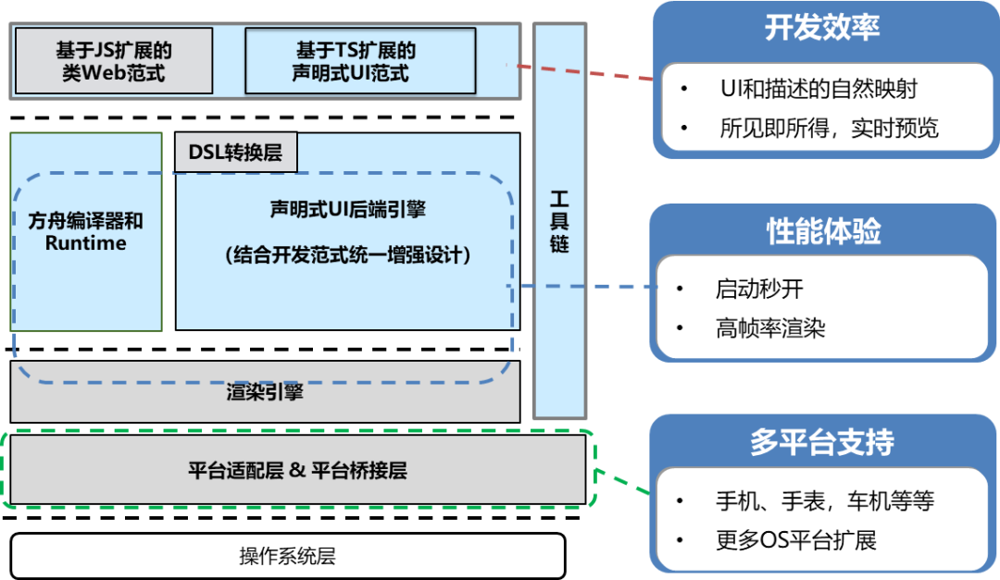

# harmony develop demo
## 1. 目录说明
- AppScope中存放应用全局所需要的资源文件。
- entry是应用的主模块，存放HarmonyOS应用的代码、资源等。
- oh_modules是工程的依赖包，存放工程依赖的源文件。
- build-profile.json5是工程级配置信息，包括签名、产品配置等。
- hvigorfile.ts是工程级编译构建任务脚本，hvigor是基于任务管理机制实现的一款全新的自动化构建工具，主要提供任务注册编排，工程模型管理、配置管理等核心能力。
- oh-package.json5是工程级依赖配置文件，用于记录引入包的配置信息。

<br>

## 2. ArkTS
ArkTS兼容TypeScript语言，拓展了声明式UI、状态管理、并发任务等能力。

以JS/TS为基础，在开发框架的维度，做了如下的架构演进设计：
- 通过基于JS扩展的类Web开发范式，来支持主流的前端开发方式。同步的，在运行时方面，通过渲染引擎的增强（平台无关的自绘制机制、声明式UI后端设计、动态布局/多态UI组件等），语言编译器和运行时的优化增强（代码预编译、高效FFI-Foreign Function Interface、引擎极小化等），进一步提升相关的性能体验，并可部署到不同设备上（包括百KB级内存的轻量设备）。另外，通过平台适配层的设计，构建了跨OS平台的基础设施。
- 通过基于TS扩展的声明式UI开发范式，提供了更简洁更自然的开发体验。在运行时方面，在上述的基础上，结合语言运行时的类型优化，以及渲染运行时的扁平化流水线技术等，进一步提升性能体验。

### 架构


### 开发范式


### 条件渲染
使用if/else进行条件渲染
```
Column() {
   if (this.count > 0) {
       Text('count is positive')
   }
}
```
### 循环渲染
开发框架提供循环渲染（ForEach组件）来迭代数组，并为每个数组项创建相应的组件。
```
ForEach(
  arr: any[], // 用于迭代的数组
  itemGenerator: (item: any, index?: number) => void, // 生成子组件的lambda函数
  keyGenerator?: (item: any, index?: number) => string // 用于给定数组项生成唯一且稳定的键值
)
```

### 组件状态管理装饰器和@Builder装饰器
组件状态管理装饰器用来管理组件中的状态，它们分别是：@State、@Prop、@Link。
- @State装饰的变量是组件内部的状态数据，当这些状态数据被修改时，将会调用所在组件的build方法进行UI刷新。
- @Prop与@State有相同的语义，但初始化方式不同。@Prop装饰的变量必须使用其父组件提供的@State变量进行初始化，允许组件内部修改@Prop变量，但更改不会通知给父组件，即@Prop属于单向数据绑定。
- @Link装饰的变量可以和父组件的@State变量建立双向数据绑定，需要注意的是：@Link变量不能在组件内部进行初始化。
- @Builder装饰的方法用于定义组件的声明式UI描述，在一个自定义组件内快速生成多个布局内容。

### 组件生命周期函数：
自定义组件的生命周期函数用于通知用户该自定义组件的生命周期，这些回调函数是私有的，在运行时由开发框架在特定的时间进行调用，
不能从应用程序中手动调用这些回调函数。 自定义组件生命周期的简化图示：


需要注意的是，部分生命周期回调函数仅对@Entry修饰的自定义组件生效，它们分别是：onPageShow、onPageHide、onBackPress。

<br>

## 应用程序入口-UIAbility
UIAbility是一种包含用户界面的应用组件，主要用于和用户进行交互。UIAbility也是系统调度的单元，为应用提供窗口在其中绘制界面。
- 一个应用可以有一个UIAbility，也可以有多个UIAbility。
- 一个UIAbility可以对应于多个页面，建议将一个独立的功能模块放到一个UIAbility中，以多页面的形式呈现。


例如：浏览器应用可以通过一个UIAbility结合多页面的形式让用户进行的搜索和浏览内容；
而聊天应用增加一个“外卖功能”的场景，则可以将聊天应用中“外卖功能”的内容独立为一个UIAbility，
当用户打开聊天应用的“外卖功能”，查看外卖订单详情，此时有新的聊天消息，即可以通过最近任务列表切换回到聊天窗口继续进行聊天对话。

demo里：
- 在src/main/ets/entryability目录下，初始会生成一个UIAbility文件EntryAbility.ts。可以在EntryAbility.ts文件中根据业务需要实现UIAbility的生命周期回调内容。
- 在src/main/ets/pages目录下，会生成一个Index页面。这也是基于UIAbility实现的应用的入口页面。可以在Index页面中根据业务需要实现入口页面的功能。

### 页面返回和参数接收
router.back()方法实现返回到上一个页面，或者在调用router.back()方法时增加可选的options参数（增加url参数）返回到指定页面.
在调用router.back()方法之前，可以先调用router.enableBackPageAlert()方法开启页面返回询问对话框功能。
```
router.back({
  url: 'pages/Index',
  params: {
    src: 'Second页面传来的数据',
  }
})
```
在Index页面通过调用router.getParams()方法，获取Second页面传递过来的自定义参数。

调用router.back()方法，不会新建页面，返回的是原来的页面，在原来页面中@State声明的变量不会重复声明，
以及也不会触发页面的aboutToAppear()生命周期回调，因此无法直接在变量声明以及页面的aboutToAppear()生命周期回调中接收和解析router.back()传递过来的自定义参数。

### UIAbility的生命周期
UIAbility的生命周期包括Create、Foreground、Background、Destroy四个状态，
WindowStageCreate和WindowStageDestroy为窗口管理器（WindowStage）在UIAbility中管理UI界面功能的两个生命周期回调，从而实现UIAbility与窗口之间的弱耦合。

-> [demo](./entry/src/main/ets/entryability)


### UIAbility的启动模式
UIAbility当前支持singleton（单实例模式）、multiton（多实例模式）和specified（指定实例模式）3种启动模式。

（1）singleton（单实例模式） 默认情况下的启动模式。
每次调用startAbility()方法时，如果应用进程中该类型的UIAbility实例已经存在，则复用系统中的UIAbility实例。
系统中只存在唯一一个该UIAbility实例，即在最近任务列表中只存在一个该类型的UIAbility实例。

module.json5 launchType指定:
```
{
   "module": {
     // ...
     "abilities": [
       {
         "launchType": "singleton",
         // ...
       }
     ]
  }
}
```
（2）multiton（多实例模式）。
multiton启动模式为多实例模式，每次调用startAbility()方法时，都会在应用进程中创建一个新的该类型UIAbility实例。
即在最近任务列表中可以看到有多个该类型的UIAbility实例。这种情况下可以将UIAbility配置为multiton（多实例模式）。

（3）specified（指定实例模式）。
针对一些特殊场景使用（例如文档应用中每次新建文档希望都能新建一个文档实例，重复打开一个已保存的文档希望打开的都是同一个文档实例）。

<br>

## 组件
组件根据功能可以分为以下五大类：基础组件、容器组件、媒体组件、绘制组件、画布组件。
其中基础组件是视图层的基本组成单元，包括Text、Image、TextInput、Button、LoadingProgress等。

### 容器组件
包括Row和Column, Row主轴是水平方向，Column主轴是垂直方向。

主轴方向参数为：start、center、end, 交叉轴方向参数为: top、center、bottom

### List组件
List是很常用的滚动类容器组件，一般和子组件ListItem、ForEach一起使用，List列表中的每一个列表项对应一个ListItem组件.

### Grid组件
Grid组件为网格容器，是一种网格列表，由“行”和“列”分割的单元格所组成，通过指定“项目”所在的单元格做出各种各样的布局。
Grid组件一般和子组件GridItem一起使用，Grid列表中的每一个条目对应一个GridItem组件。

### Tabs
ArkUI开发框架提供了一种页签容器组件Tabs，开发者通过Tabs组件可以很容易的实现内容视图的切换。
页签容器Tabs的形式多种多样，不同的页面设计页签不一样，可以把页签设置在底部、顶部或者侧边。

Tabs组件仅可包含子组件TabContent，每一个页签对应一个内容视图即TabContent组件。

barPosition的值可以设置为BarPosition.Start（默认值）和BarPosition.End。
- BarPosition.Start且vertical属性方法设置为false（默认值）时，页签位于容器顶部。
- BarPosition.Start且vertical属性方法设置为true时，页签位于容器左侧。
- BarPosition.End且vertical属性方法设置为false时，页签位于容器底部。
- BarPosition.End且vertical属性方法设置为true时，页签位于容器右侧。

<br>

## reference
- https://developer.harmonyos.com/cn/docs/documentation/doc-guides/arkui-overview-0000001281480754
- https://developer.harmonyos.com/cn/docs/documentation/doc-references/ts-basic-components-text-0000001333720953
- https://developer.harmonyos.com/cn/docs/documentation/doc-references-V3/ts-container-list-0000001477981213-V3?catalogVersion=V3