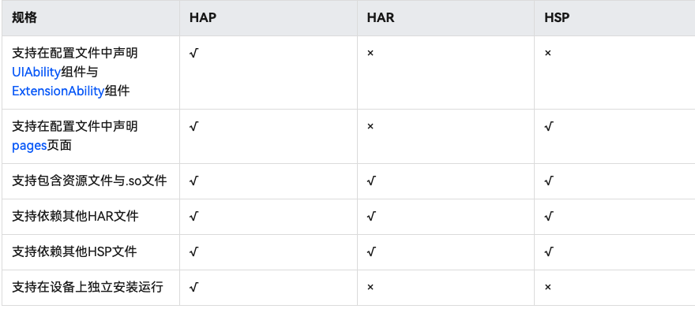
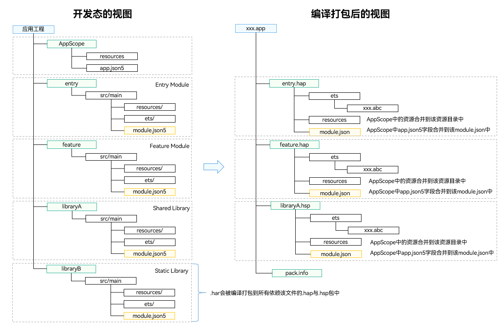

# HAP、HAR、HSP三种包类型对比
## HAP
应用的功能模块，可以独立安装和运行，必须包含一个entry类型的HAP，可选包含一个或多个feature类型的HAP。 
Module类型为 Ability。

## HAR
静态共享包，编译态复用。
- 支持应用内共享，也可以发布后供其他应用使用。
- 作为二方库，发布到OHPM私仓，供公司内部其他应用使用。
- 作为三方库，发布到OHPM中心仓，供其他应用使用。
- 多包（HAP/HSP）引用相同的HAR时，会造成多包间代码和资源的重复拷贝，从而导致应用包膨大。
- 注意：编译HAR时，建议开启混淆能力，保护代码资产。
- HAR不支持在设备上单独安装/运行，只能作为应用模块的依赖项被引用。
- HAR不支持在配置文件中声明UIAbility组件与ExtensionAbility组件。
- HAR不支持在配置文件中声明pages页面，但是可以包含pages页面，并通过命名路由的方式进行跳转。
- HAR不支持引用AppScope目录中的资源。在编译构建时，AppScope中的内容不会打包到HAR中，因此会导致HAR资源引用失败。
- HAR可以依赖其他HAR，但不支持循环依赖，也不支持依赖传递。

Module类型为 Static Library

## HSP
动态共享包，运行时复用。
- 当前仅支持应用内共享。
- 当多包（HAP/HSP）同时引用同一个共享包时，采用HSP替代HAR，可以避免HAR造成的多包间代码和资源的重复拷贝，从而减小应用包大小。
- HSP不支持在设备上单独安装/运行，需要与依赖该HSP的HAP一起安装/运行。HSP的版本号必须与HAP版本号一致。
- HSP不支持在配置文件中声明UIAbility组件与ExtensionAbility组件。
- HSP可以依赖其他HAR或HSP，但不支持循环依赖，也不支持依赖传递。

## 场景

## 编译态包结构
不同类型的Module编译后会生成对应的HAP、HAR、HSP等文件，开发态视图与编译态视图的对照关系如下：

## 创建一个HSP包
https://developer.huawei.com/consumer/cn/doc/harmonyos-guides-V5/ide-hsp-V5#section7717162312546

## 创建一个HAR包
https://developer.huawei.com/consumer/cn/doc/harmonyos-guides-V5/ide-har-V5#section643521083015

## reference
- https://developer.huawei.com/consumer/cn/training/course/slightMooc/C101705071657237039