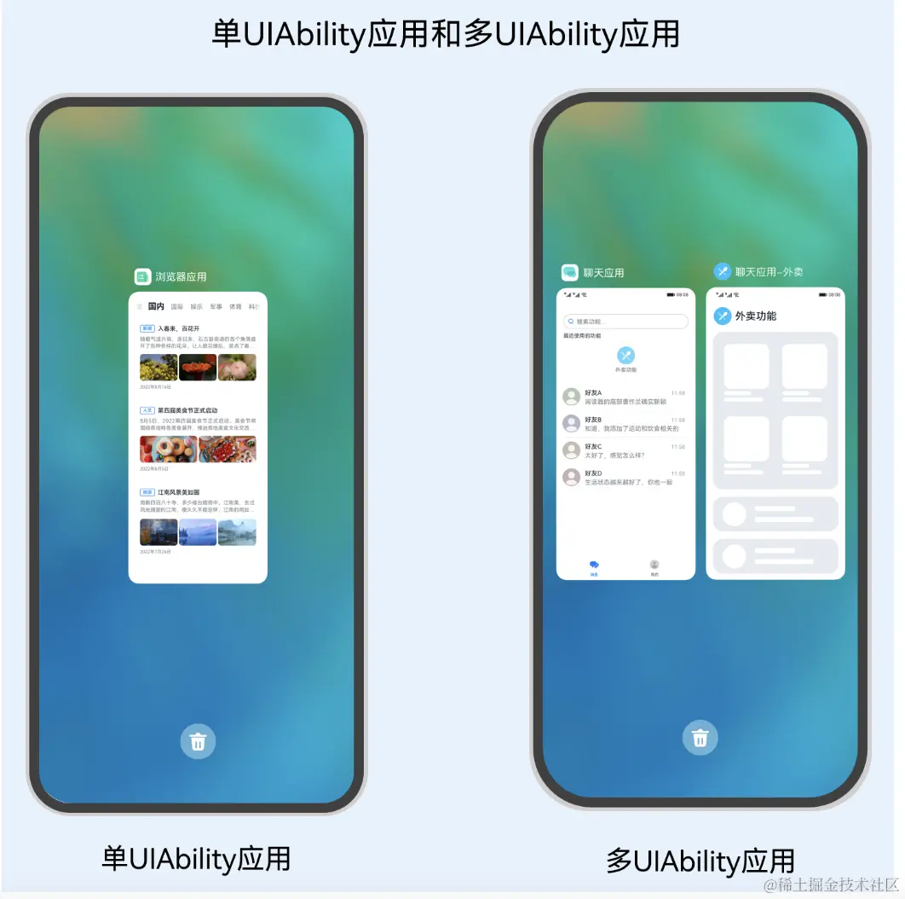

# 应用程序入口-UIAbility
UIAbility是一种包含用户界面的应用组件，主要用于和用户进行交互。UIAbility也是系统调度的单元，为应用提供窗口在其中绘制界面。
- 一个应用可以有一个UIAbility，也可以有多个UIAbility。
- 一个UIAbility可以对应于多个页面，建议将一个独立的功能模块放到一个UIAbility中，以多页面的形式呈现。



例如：浏览器应用可以通过一个UIAbility结合多页面的形式让用户进行的搜索和浏览内容；
而聊天应用增加一个“外卖功能”的场景，则可以将聊天应用中“外卖功能”的内容独立为一个UIAbility，
当用户打开聊天应用的“外卖功能”，查看外卖订单详情，此时有新的聊天消息，即可以通过最近任务列表切换回到聊天窗口继续进行聊天对话。

demo里：
- 在src/main/ets/entryability目录下，初始会生成一个UIAbility文件EntryAbility.ts。可以在EntryAbility.ts文件中根据业务需要实现UIAbility的生命周期回调内容。
- 在src/main/ets/pages目录下，会生成一个Index页面。这也是基于UIAbility实现的应用的入口页面。可以在Index页面中根据业务需要实现入口页面的功能。

## 页面返回和参数接收
router.back()方法实现返回到上一个页面，或者在调用router.back()方法时增加可选的options参数（增加url参数）返回到指定页面.
在调用router.back()方法之前，可以先调用router.enableBackPageAlert()方法开启页面返回询问对话框功能。
```
router.back({
  url: 'pages/Index',
  params: {
    src: 'Second页面传来的数据',
  }
})
```
在Index页面通过调用router.getParams()方法，获取Second页面传递过来的自定义参数。

调用router.back()方法，不会新建页面，返回的是原来的页面，在原来页面中@State声明的变量不会重复声明，
以及也不会触发页面的aboutToAppear()生命周期回调，因此无法直接在变量声明以及页面的aboutToAppear()生命周期回调中接收和解析router.back()传递过来的自定义参数。

## UIAbility的生命周期
UIAbility的生命周期包括Create、Foreground、Background、Destroy四个状态，
WindowStageCreate和WindowStageDestroy为窗口管理器（WindowStage）在UIAbility中管理UI界面功能的两个生命周期回调，从而实现UIAbility与窗口之间的弱耦合。

-> [demo](../entry/src/main/ets/entryability)


## UIAbility的启动模式
UIAbility当前支持singleton（单实例模式）、multiton（多实例模式）和specified（指定实例模式）3种启动模式。

（1）singleton（单实例模式） 默认情况下的启动模式。
每次调用startAbility()方法时，如果应用进程中该类型的UIAbility实例已经存在，则复用系统中的UIAbility实例。
系统中只存在唯一一个该UIAbility实例，即在最近任务列表中只存在一个该类型的UIAbility实例。

module.json5 launchType指定:
```
{
   "module": {
     // ...
     "abilities": [
       {
         "launchType": "singleton",
         // ...
       }
     ]
  }
}
```
（2）multiton（多实例模式）。
multiton启动模式为多实例模式，每次调用startAbility()方法时，都会在应用进程中创建一个新的该类型UIAbility实例。
即在最近任务列表中可以看到有多个该类型的UIAbility实例。这种情况下可以将UIAbility配置为multiton（多实例模式）。

（3）specified（指定实例模式）。
针对一些特殊场景使用（例如文档应用中每次新建文档希望都能新建一个文档实例，重复打开一个已保存的文档希望打开的都是同一个文档实例）。

详见 ability-start-mode