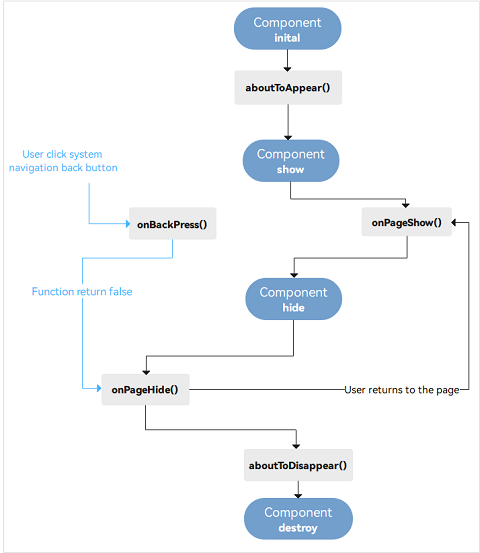

# 组件
组件根据功能可以分为以下五大类：基础组件、容器组件、媒体组件、绘制组件、画布组件。
其中基础组件是视图层的基本组成单元，包括Text、Image、TextInput、Button、LoadingProgress等。

## 容器组件
包括Row和Column, Row主轴是水平方向，Column主轴是垂直方向。

主轴方向参数为：start、center、end, 交叉轴方向参数为: top、center、bottom

## List组件
List是很常用的滚动类容器组件，一般和子组件ListItem、ForEach一起使用，List列表中的每一个列表项对应一个ListItem组件.
ListItem组件要求ForEach的父容器组件必须为List组件。

## Grid组件
Grid组件为网格容器，是一种网格列表，由“行”和“列”分割的单元格所组成，通过指定“项目”所在的单元格做出各种各样的布局。
Grid组件一般和子组件GridItem一起使用，Grid列表中的每一个条目对应一个GridItem组件。

## Tabs
ArkUI开发框架提供了一种页签容器组件Tabs，开发者通过Tabs组件可以很容易的实现内容视图的切换。
页签容器Tabs的形式多种多样，不同的页面设计页签不一样，可以把页签设置在底部、顶部或者侧边。

Tabs组件仅可包含子组件TabContent，每一个页签对应一个内容视图即TabContent组件。

barPosition的值可以设置为BarPosition.Start（默认值）和BarPosition.End。
- BarPosition.Start且vertical属性方法设置为false（默认值）时，页签位于容器顶部。
- BarPosition.Start且vertical属性方法设置为true时，页签位于容器左侧。
- BarPosition.End且vertical属性方法设置为false时，页签位于容器底部。
- BarPosition.End且vertical属性方法设置为true时，页签位于容器右侧。

## Swiper组件
滑块视图容器，提供子组件滑动轮播显示的能力。

## Navigator组件
路由容器组件，提供路由跳转能力。

<br>

## video
借助Video组件，我们可以实现视频的播放功能并控制其播放状态。

Video组件的接口表达形式为：
```
Video(value: {src?: string | Resource, currentProgressRate?: number | string |PlaybackSpeed, previewUri?: string |PixelMap | Resource, controller?: VideoController})
```
其中包含四个可选参数，src、currentProgressRate、previewUri和controller:
- src表示视频播放源的路径，可以支持本地视频路径和网络路径。使用网络地址时，如https，需要注意的是需要在module.json5文件中申请网络权限。在使用本地资源播放时，当使用本地视频地址我们可以使用媒体库管理模块medialibrary来查询公共媒体库中的视频文件;
- currentProgressRate表示视频播放倍速，其参数类型为number，取值支持0.75，1.0，1.25，1.75，2.0，默认值为1.0倍速；
- previewUri表示视频未播放时的预览图片路径；
- controller表示视频控制器。

## 弹窗
弹窗按照功能可以分为以下两类
- 确认类：例如警告弹窗AlertDialog。
- 选择类：包括文本选择弹窗TextPickerDialog 、日期滑动选择弹窗DatePickerDialog、时间滑动选择弹窗TimePickerDialog等。

除此之外，还可以自定义弹窗。

AlertDialog Example:
```
Button('点击显示弹窗')
  .onClick(() => {
    AlertDialog.show(
      {
        title: '删除联系人', // 标题
        message: '是否需要删除所选联系人?', // 内容
        autoCancel: false, // 点击遮障层时，是否关闭弹窗。
        alignment: DialogAlignment.Bottom, // 弹窗在竖直方向的对齐方式
        offset: { dx: 0, dy: -20 }, // 弹窗相对alignment位置的偏移量
        primaryButton: {
          value: '取消',
          action: () => {
            console.info('Callback when the first button is clicked');
          }
        },
        secondaryButton: {
          value: '删除',
          fontColor: '#D94838',
          action: () => {
            console.info('Callback when the second button is clicked');
          }
        },
        cancel: () => { // 点击遮障层关闭dialog时的回调
          console.info('Closed callbacks');
        }
      }
    )
  })
```

## 组件生命周期函数：
自定义组件的生命周期函数用于通知用户该自定义组件的生命周期，这些回调函数是私有的，在运行时由开发框架在特定的时间进行调用，
不能从应用程序中手动调用这些回调函数。 自定义组件生命周期的简化图示：



需要注意的是，部分生命周期回调函数仅对@Entry修饰的自定义组件生效，它们分别是：onPageShow、onPageHide、onBackPress。

## 组件状态管理装饰器和@Builder装饰器
组件状态管理装饰器用来管理组件中的状态，它们分别是：@State、@Prop、@Link。
- @State装饰的变量是组件内部的状态数据，当这些状态数据被修改时，将会调用所在组件的build方法进行UI刷新。
- @Prop与@State有相同的语义，但初始化方式不同。@Prop装饰的变量必须使用其父组件提供的@State变量进行初始化，允许组件内部修改@Prop变量，但更改不会通知给父组件，即@Prop属于单向数据绑定。
- @Link装饰的变量可以和父组件的@State变量建立双向数据绑定，需要注意的是：@Link变量不能在组件内部进行初始化。
- @Provide和@Consume 可以实现跨组件层级双向同步状态。
- @Builder装饰的方法用于定义组件的声明式UI描述，在一个自定义组件内快速生成多个布局内容。

在实际应用开发中，应用会根据需要封装数据模型。如果需要观察<strong>嵌套类对象属性变化</strong>，需要使用@Observed和@ObjectLink装饰器，
因为上述装饰器只能观察到对象的第一层属性变化。
@Observed和@ObjectLink装饰器的具体使用方法可参考[@Observed装饰器和@ObjectLink装饰器：嵌套类对象属性变化](https://developer.harmonyos.com/cn/docs/documentation/doc-guides-V3/arkts-observed-and-objectlink-0000001473697338-V3?catalogVersion=V3)。


## 组件预览
通过菜单栏，单击View>Tool Windows>Previewer打开预览器。

ArkTS应用/服务支持组件预览，要求compileSdkVersion为8或以上。
组件预览支持实时预览，不支持动态图和动态预览。
组件预览通过在组件前添加注解@Preview实现，在单个源文件中，最多可以使用10个@Preview装饰自定义组件。

DevEco Studio提供HarmonyOS应用/服务的UI预览界面与源代码文件间的双向预览功能，支持ets文件、hml文件及xml文件与预览器界面的双向预览。
使用双向预览功能时，需要在预览器界面单击Tt图标打开双向预览功能。

<br>

## reference
- https://developer.harmonyos.com/cn/docs/documentation/doc-references/ts-basic-components-text-0000001333720953
- https://developer.harmonyos.com/cn/docs/documentation/doc-references-V3/ts-container-list-0000001477981213-V3?catalogVersion=V3
- https://developer.harmonyos.com/cn/docs/documentation/doc-references-V3/ts-media-components-video-0000001427902484-V3?catalogVersion=V3
- https://developer.huawei.com/consumer/cn/training/course/slightMooc/C101680765314766141